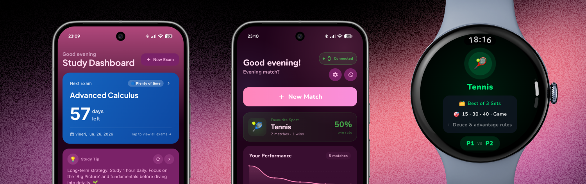

# Cristi Media Group

**Cristi Media Group** is an independent Android development studio based in Belgium, dedicated to crafting high-quality, privacy-focused, and efficient mobile applications. Since 2018, we have been committed to building clean code and providing regular, reliable updates.

## About Us
We believe that apps should be simple, functional, and user-centric. Our approach is "Quality First": we obsess over crafted interfaces and distraction-free user experiences. We are a solo-driven venture that values transparency, security, and the trust of our users.

## Our Core Principles
*   **Quality First:** We focus on perfectly crafted interfaces that prioritize user experience.
*   **Privacy & Security:** We leverage modern security technologies and encryption to keep your data safe. We are transparent about data handling and strictly follow privacy-first policies.
*   **Offline-First:** Wherever possible, our apps are designed to work without unnecessary tracking or account requirements.
*   **Transparency:** We believe in open communication. Security-minded users are welcome to reach out for code audits.

## Featured Apps

### 🎓 Studown
*The ultimate study companion.*
Track exam dates, build study streaks, and stay motivated.
*   **Features:** Offline-first, no ads, no tracking, built-in study streak tracking.
*   [Download on Play Store]([https://play.google.com/](https://play.google.com/store/apps/details?id=com.cristimediagroup.studown))

### 🎾 Scoreon
*The Ultimate Racket Sports Score Tracker.*
Take your game to the next level with real-time score tracking for Tennis, Padel, Badminton, Squash, and Table Tennis.
*   **Features:** Distraction-free UI, full Wear OS companion app, detailed match history.
*   [Download on Play Store]([https://play.google.com/](https://play.google.com/store/apps/details?id=com.cristimediagroup.scoreon))
## Connect with Us
We love hearing from our users and fellow developers!

*   **Website:** [cristimediagroup.com](https://cristimediagroup.com)
*   **Instagram:** [@acristian007](https://instagram.com/acristian007)
*   **Phone:** +32 470/11.85.39
*   **Inquiries:** Feel free to reach out via the [contact form](https://cristimediagroup.com) on our website for support, partnership, or code review requests.

***
*© 2026 Cristi Media Group and Cristi Media Studios. All rights reserved. Based in Belgium.*
